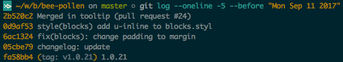
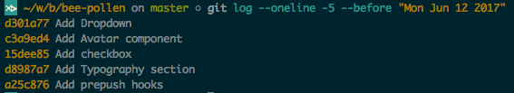

# Guia de Commits Eficientes

- O que esse commit "whatever" faz?
- Não sei, abre o código para descobrir.
- Isso não é ideal, certo?


Já se encontrou nessa situação? É frustrante, não? Vamos conversar sobre como evitar isso e criar mensagens de *commit* claras e amigáveis.

A ideia é simples: sem um padrão, o `git log` se torna uma bagunça difícil de navegar.

Aqui estão os benefícios de seguir boas práticas de *commit*:

* Facilitar a navegação no histórico de *commits*;
* Manter um padrão consistente entre os desenvolvedores;
* Fornecer contexto claro para cada mudança;
* Melhorar a mantenibilidade do projeto a longo prazo;
* Facilitar a criação de *changelogs*.

## Como criar um histórico de *commits* claro e eficiente?

O time deve seguir uma convenção que aborde os seguintes aspectos:

### Estilo
Defina regras claras para a sintaxe, gramática, capitalização e pontuação. Isso evita mal-entendidos e torna o processo mais simples e previsível.

### Conteúdo
Decida o que deve ser incluído no corpo da mensagem. Evite detalhes irrelevantes e foque no que realmente importa: **o que foi alterado** e **por que**.

### Metadados
Estabeleça um padrão para rastrear referências, como números de *issues* ou *pull requests*, garantindo que todas as mudanças sejam corretamente vinculadas ao contexto de trabalho.

Ao seguir essas diretrizes, seu log de *commits* pode se parecer com isso:



Em vez de algo confuso como:



## Anatomia de um *Commit* Eficiente

Adotar uma convenção clara é essencial. No nosso caso, seguimos o modelo do _Karma Commit Messages_.

### Formato Recomendado


### Assunto

O assunto é a linha principal do *commit*. Deve ser conciso e descritivo.

* Limite de 50 caracteres;
* O tipo e escopo devem estar em letras minúsculas;
* Use o verbo no imperativo.

Exemplo:

`feat(autenticacao): adiciona endpoint /login/`.

#### Tipos Permitidos:

* **feat** – Nova funcionalidade;
* **style** – Ajustes de formatação (não confundir com CSS);
* **refactor** – Refatoração do código de produção;
* **test** – Inclusão ou refatoração de testes;
* **fix** – Correções de bugs;
* **docs** – Alterações na documentação;
* **chore** – Atualizações de tarefas ou códigos auxiliares que não afetam a produção.

### Corpo

O corpo da mensagem de *commit* deve fornecer mais detalhes sobre a alteração.

* Deve explicar **o que foi alterado** e **por que**, ao invés de **como** foi feito;
* Limite de 80 caracteres por linha.

Se a alteração precisa de mais contexto, use o corpo do *commit* para fornecer essa explicação.

Exemplo:


```
refactor(bregumelo): modifica a chamada do model

A chamada anterior sofreu alterações de contrato, logo, foi necessário
refatorá-la.


Closes #123
 ```

### Rodapé

O rodapé é usado para incluir metadados, como referências a *issues* ou *pull requests*. Isso é útil para rastrear as mudanças e relacioná-las com tickets ou tarefas específicas.


## Links

* [Karma Commit Messages](http://karma-runner.github.io/1.0/dev/git-commit-msg.html)


